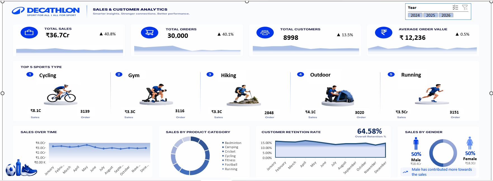

# 📊 Decathlon Sales & Customer Analytics Dashboard (Microsoft Excel)

<p align="center">


</p>

---

# 📌 Project Overview

This project demonstrates how **Microsoft Excel** can be used as a complete Business Intelligence solution to analyze retail sales data and build an interactive executive dashboard.

Using **Power Query**, **Power Pivot**, **Pivot Tables**, **Pivot Charts**, and advanced Excel features, the project transforms raw transactional data into meaningful business insights that support data-driven decision making.

---

# 📷 Dashboard Preview

<p align="center">



</p>

---

# 🎯 Business Objective

The goal of this project is to help business stakeholders answer questions such as:

- How much revenue has been generated?
- How many customers placed orders?
- Which sports categories drive the highest sales?
- What is the customer retention rate?
- How has sales performance changed over time?
- What is the average order value?
- How do male and female customers contribute to revenue?

---

# 📁 Repository Structure

```
Decathlon-Sales-Analytics
│
├── Dashboard.png
├── Decathlon.xlsx
├── Decathlon_Synthetic_Data_30000.xlsx
└── README.md
```

---

# 📂 Dataset Information

| Attribute | Details |
|-----------|---------|
| Industry | Retail |
| Brand | Decathlon (Synthetic Dataset) |
| Records | 30,000+ |
| Format | Excel (.xlsx) |

The dataset contains sales transactions, customer information, product categories, order details, and yearly sales records.

---

# 🛠 Tools & Technologies

- Microsoft Excel
- Power Query
- Power Pivot
- Pivot Tables
- Pivot Charts
- Slicers
- Timelines
- Conditional Formatting
- Data Modeling
- Excel Functions

---

# 🔄 Data Analytics Workflow

```
Raw Dataset
      │
      ▼
Power Query
(Data Cleaning & Transformation)
      │
      ▼
Power Pivot
(Data Modeling)
      │
      ▼
Pivot Tables
      │
      ▼
Interactive Dashboard
      │
      ▼
Business Insights
```

---

# 🧹 Data Preparation

The dataset was prepared using Power Query by:

- Removing duplicate records
- Handling missing values
- Correcting data types
- Standardizing column names
- Cleaning inconsistent text values
- Preparing data for analysis

---

# 📊 Dashboard Features

### Executive KPIs

- 💰 Total Sales
- 🛒 Total Orders
- 👥 Total Customers
- 💳 Average Order Value

### Interactive Reports

- 📈 Sales Trend Analysis
- 🏆 Top 5 Sports Categories
- 📦 Product Category Distribution
- 👨‍🦱👩‍🦰 Gender-wise Sales
- 📅 Year-wise Filtering
- 📊 Customer Retention Analysis

---

# 📌 Key Performance Indicators

| KPI | Description |
|------|-------------|
| Total Sales | Overall business revenue |
| Total Orders | Total completed orders |
| Total Customers | Unique customer count |
| Average Order Value | Revenue per order |
| Customer Retention Rate | Percentage of returning customers |

---

# 💼 Business Questions Solved

- What is the overall sales revenue?
- Which sports category generates the highest revenue?
- Which product categories perform best?
- How many customers placed orders?
- How does sales change month over month?
- Which customer segment contributes the most revenue?
- What is the retention percentage?
- What is the average spending per order?

---

# 📈 Key Insights

- Cycling generated the highest revenue among all sports categories.
- Customer retention remained consistently above 60%.
- Sales performance remained stable throughout the year.
- Running and Outdoor categories maintained strong order volumes.
- Male and Female customers contributed almost equally to total sales.
- Interactive slicers allow users to analyze different years dynamically.

---

# 💡 Skills Demonstrated

### Data Cleaning

- Power Query
- Data Transformation
- Data Validation

### Data Analysis

- KPI Development
- Trend Analysis
- Customer Analysis
- Sales Analysis

### Dashboard Development

- Executive Dashboard Design
- Interactive Reporting
- Dynamic Charts
- Slicers & Timelines

### Business Intelligence

- Performance Monitoring
- Decision Support
- Data Visualization
- Retail Analytics

---

# 🚀 Project Outcome

Designed and developed a fully interactive retail sales dashboard using Microsoft Excel that enables users to monitor KPIs, analyze customer behavior, identify high-performing categories, and make informed business decisions through dynamic visualizations.

---

# ⭐ Core Skills

- Microsoft Excel
- Power Query
- Power Pivot
- Pivot Tables
- Pivot Charts
- Dashboard Design
- Data Cleaning
- Data Transformation
- Business Intelligence
- Data Visualization
- Retail Analytics

---

# 📬 Connect With Me

**Tiya Rajput**

- 💼 LinkedIn: *(Add Your LinkedIn URL)*
- 💻 GitHub: https://github.com/TiyaRajput123

---

### ⭐ If you found this project helpful, consider giving it a Star!
